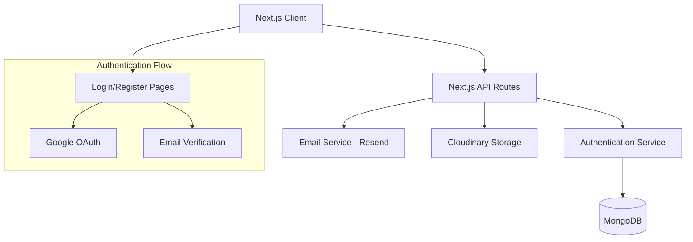
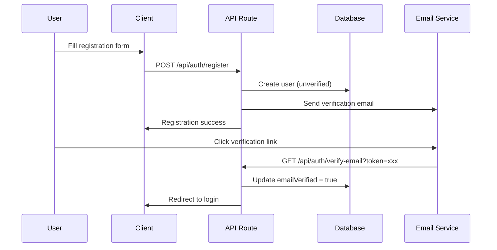
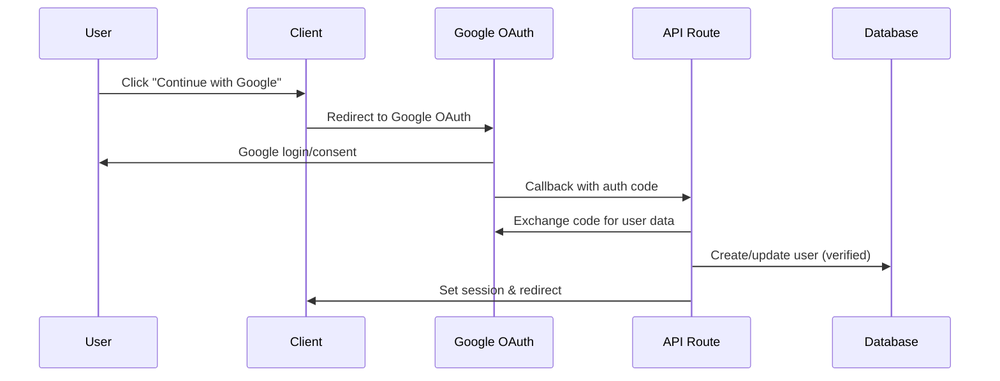
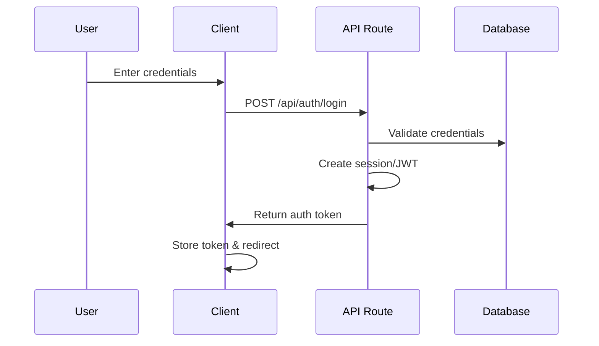

# Authentication System Design Document

## Overview

The authentication system for Barber Hub will provide comprehensive user management with both manual registration/login and Google OAuth integration. The system will be built using Next.js 15 with TypeScript, MongoDB with Mongoose, and will integrate with external services like Resend for email verification and Cloudinary for profile picture storage.

## Architecture

### High-Level Architecture



### Technology Stack

- **Frontend**: Next.js 15 with React 19, TypeScript, Tailwind CSS
- **Backend**: Next.js API Routes
- **Database**: MongoDB with Mongoose ODM
- **Authentication**: NextAuth.js (to be added)
- **Email Service**: Resend
- **File Storage**: Cloudinary
- **UI Components**: Existing shadcn/ui setup with Lucide React icons

## Components and Interfaces

### 1. User Model and Schema

```typescript
interface IUser extends Document {
  name: string;
  email: string;
  password?: string; // Optional for Google OAuth users
  profilePicture?: {
    url: string;
    publicId: string;
  };
  emailVerified: boolean;
  emailVerificationToken?: string;
  emailVerificationExpires?: Date;
  role: 'user' | 'staff' | 'owner' | 'admin';
  salonId?: mongoose.Types.ObjectId;
  provider: 'email' | 'google';
  googleId?: string;
  createdAt: Date;
  updatedAt: Date;
}
```

### 2. Navigation Component

```typescript
interface NavbarProps {
  user?: {
    name: string;
    email: string;
    profilePicture?: string;
  } | null;
}
```

### 3. Authentication Pages

- **Login Page**: `/auth/login`
- **Register Page**: `/auth/register`
- **Profile Page**: `/profile`
- **Email Verification**: `/auth/verify-email`

### 4. API Routes Structure

```
/api/auth/
├── register/
│   └── route.ts
├── login/
│   └── route.ts
├── verify-email/
│   └── route.ts
├── google/
│   └── route.ts
├── logout/
│   └── route.ts
└── profile/
    └── route.ts
```

### 5. Service Layer

```typescript
// Authentication Service
interface AuthService {
  register(userData: RegisterData): Promise<User>;
  login(credentials: LoginCredentials): Promise<AuthResult>;
  verifyEmail(token: string): Promise<boolean>;
  googleAuth(googleData: GoogleAuthData): Promise<AuthResult>;
}

// Email Service
interface EmailService {
  sendVerificationEmail(email: string, token: string): Promise<boolean>;
  sendPasswordResetEmail(email: string, token: string): Promise<boolean>;
}

// Upload Service
interface UploadService {
  uploadProfilePicture(file: File, userId: string): Promise<CloudinaryResult>;
  deleteProfilePicture(publicId: string): Promise<boolean>;
}
```

## Data Models

### User Schema Design

```typescript
const UserSchema = new Schema<IUser>({
  name: {
    type: String,
    required: true,
    trim: true,
    minLength: [2, 'Name must be at least 2 characters'],
    maxLength: [50, 'Name cannot exceed 50 characters']
  },
  email: {
    type: String,
    required: true,
    unique: true,
    trim: true,
    lowercase: true,
    match: [/^[\w-\.]+@([\w-]+\.)+[\w-]{2,4}$/, 'Invalid email format']
  },
  password: {
    type: String,
    minLength: [8, 'Password must be at least 8 characters'],
    select: false // Don't include in queries by default
  },
  profilePicture: {
    url: String,
    publicId: String
  },
  emailVerified: {
    type: Boolean,
    default: false
  },
  emailVerificationToken: String,
  emailVerificationExpires: Date,
  role: {
    type: String,
    enum: ['user', 'staff', 'owner', 'admin'],
    default: 'user'
  },
  salonId: {
    type: Schema.Types.ObjectId,
    ref: 'Salon'
  },
  provider: {
    type: String,
    enum: ['email', 'google'],
    required: true
  },
  googleId: String
}, { timestamps: true });
```

### Database Indexes

```typescript
UserSchema.index({ email: 1 }, { unique: true });
UserSchema.index({ emailVerificationToken: 1 });
UserSchema.index({ googleId: 1 });
UserSchema.index({ salonId: 1 });
```

## Authentication Flow

### Manual Registration Flow



### Google OAuth Flow



### Login Flow



## Error Handling

### Centralized Error Handler

```typescript
class AuthError extends Error {
  constructor(
    message: string,
    public statusCode: number = 400,
    public code?: string
  ) {
    super(message);
    this.name = 'AuthError';
  }
}

// Error types
export const AUTH_ERRORS = {
  INVALID_CREDENTIALS: 'INVALID_CREDENTIALS',
  EMAIL_NOT_VERIFIED: 'EMAIL_NOT_VERIFIED',
  USER_EXISTS: 'USER_EXISTS',
  INVALID_TOKEN: 'INVALID_TOKEN',
  UPLOAD_FAILED: 'UPLOAD_FAILED'
} as const;
```

### API Error Response Format

```typescript
interface ErrorResponse {
  success: false;
  error: {
    message: string;
    code?: string;
    field?: string; // For validation errors
  };
}

interface SuccessResponse<T = unknown> {
  success: true;
  data: T;
  message?: string;
}
```

## Security Considerations

### Password Security
- Passwords hashed using bcrypt with salt rounds of 12
- Minimum 8 characters with complexity requirements
- Password field excluded from queries by default

### Session Management
- JWT tokens with short expiration (15 minutes)
- Refresh tokens for extended sessions
- Secure HTTP-only cookies for token storage

### Email Verification
- Cryptographically secure tokens
- Token expiration (24 hours)
- Rate limiting on verification requests

### File Upload Security
- File type validation (images only)
- File size limits (5MB max)
- Cloudinary transformation for security

### API Security
- Rate limiting on authentication endpoints
- CORS configuration
- Input validation and sanitization
- SQL injection prevention through Mongoose

## Testing Strategy

### Unit Tests
- User model validation
- Authentication service methods
- Email service functionality
- Upload service operations
- Error handling scenarios

### Integration Tests
- API route functionality
- Database operations
- External service integrations (Resend, Cloudinary)
- Authentication flows end-to-end

### Component Tests
- Navigation component with different auth states
- Login/Register form validation
- Profile page rendering
- File upload functionality

### Test Data Management
- Mock external services in tests
- Test database seeding
- Cleanup procedures for test isolation

## Performance Considerations

### Database Optimization
- Proper indexing on frequently queried fields
- Connection pooling for MongoDB
- Query optimization for user lookups

### Caching Strategy
- Session data caching
- User profile caching
- Static asset optimization

### Image Optimization
- Cloudinary automatic optimization
- Multiple image sizes for different use cases
- Lazy loading for profile pictures

## Deployment and Configuration

### Environment Variables
```
# Database
MONGODB_URI=mongodb://localhost:27017/barberhub

# Authentication
NEXTAUTH_SECRET=your-secret-key
NEXTAUTH_URL=http://localhost:3000

# Google OAuth
GOOGLE_CLIENT_ID=your-google-client-id
GOOGLE_CLIENT_SECRET=your-google-client-secret

# Email Service
RESEND_API_KEY=your-resend-api-key

# File Storage
CLOUDINARY_CLOUD_NAME=your-cloud-name
CLOUDINARY_API_KEY=your-api-key
CLOUDINARY_API_SECRET=your-api-secret
```

### Production Considerations
- HTTPS enforcement
- Environment-specific configurations
- Monitoring and logging
- Backup strategies for user data
- GDPR compliance for user data handling